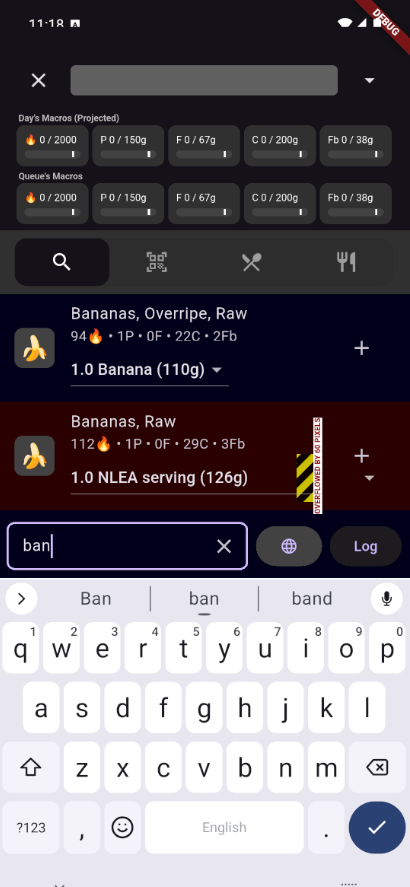
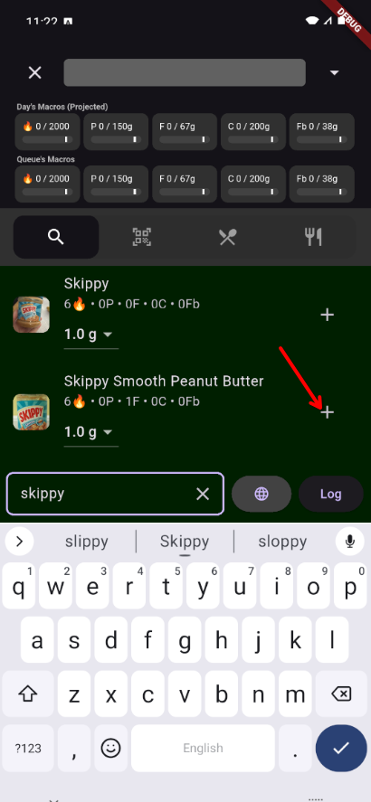
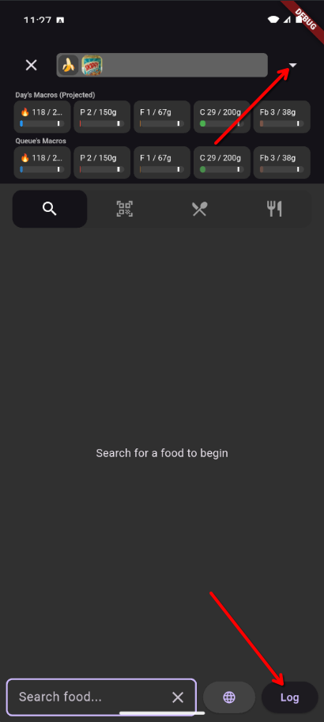

# Your First Meal

This walkthrough takes about a minute. By the end, you'll have logged your first food entry.

## 1. Open Search

From the **Overview** or **Log** screen, tap the search bar at the bottom of the screen.

## 2. Find a Food

Start typing. The app searches your foods first, then shows results from the built-in food library (USDA data).

Results are color-coded so you can tell where they came from at a glance:

- **Gray background** — Foods you've used before (always appear at the top)
- **Blue background** — High-quality USDA reference data
- **Red background** — Older USDA data

Can't find what you're looking for? Tap the **globe icon** to search the Open Food Facts database, which covers millions of packaged products.

## 3. Add It to Your Queue

Tap the **(+)** button on a food to add one serving to your **Log Queue** — a staging area where you build your meal before logging it.

!!! tip "Need a specific amount?"
    Tap the food's name instead of the (+) button to open the Quantity Edit screen, where you can pick a serving size, enter a custom weight, or even type a math expression like `2.5 * 28`.
    
!!! tip "Food image too small?"
    Tap a search result's thumbnail to see a larger version of it

## 4. Log It

Tap the **down arrow** at the top of the search screen to see your queue, then tap **Log** to commit everything to your daily diary.

That's it — your first entry is saved.

## Quick Add: The Shortcut

If you can't practically enter a food but you have some perspective on how many caloires it had, maybe you went out to eat, use **Quick Add** from the search screen to type in the calories directly.

## Next Steps

- [Logging Food](guides/logging.md) — The full guide to search, barcodes, Quick Add, containers, and more
- [Creating Custom Foods](guides/custom-foods.md) — Add foods that aren't in any database
- [Goals & Weight Tracking](guides/goals.md) — Set up calorie targets that adjust to your progress
