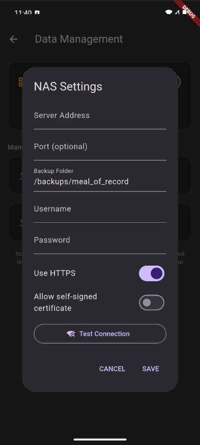

# Backing Up Your Data

Your food logs, custom foods, recipes, weight history, goals, and container settings all live on your device. Meal of Record gives you two ways to keep that data safe.

## Automatic Backup (NAS / WebDAV)

You can configure the app to automatically back up to a personal NAS or any WebDAV-compatible server.

### Setup

1. Enable WebDAV in your NAS if it's not already enabled.
2. Go to **Settings → Data Management → Cloud Backup**.
3. Enter your NAS info.
4. The app will back up automatically every morning assuming you've made changes since the last backup as long as your device can reach the server (same local network, or via VPN for remote access).

### How It Works

- **Smart backups** — The app only uploads when something has actually changed, saving battery and bandwidth.
- **Retention** — You can configure how many days of backups to keep (default is 7). Older backups are automatically cleaned up.
- **Private** — Backups go to your own server, not to any third-party cloud service.

---

## Manual Export / Import

You can also manually export your entire dataset as a file and store it wherever you like.

### Export

Go to **Settings → Data Management → Export**. This generates a backup file containing everything: food logs, custom foods, recipes, weight history, goals, containers, and images. You can save it to your phone's storage or share it via any app (email, messaging, file manager, etc.).

### Import

Go to **Settings → Data Management → Import** and select a previously exported backup file.

!!! warning "Import replaces everything"
    Importing a backup is a destructive action — it completely replaces your current data with the contents of the backup file. Always make a fresh export before importing, just in case.

---

## Images

The app automatically manages food and recipe images for you. Images are resized to keep things fast, and orphaned images (no longer linked to any food or recipe) are cleaned up automatically. You don't need to think about this — it just works.

---

## Offline First

Meal of Record works entirely offline. Searching, logging, editing, and everything else happens on your device with no internet required.

The only features that need a connection are:

- **Open Food Facts search** — Fetches packaged food data from the internet.
- **Automatic backups** — Needs to reach your NAS/WebDAV server.

If you're offline, these features simply wait until a connection is available.
