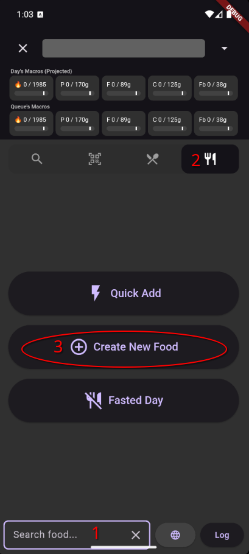
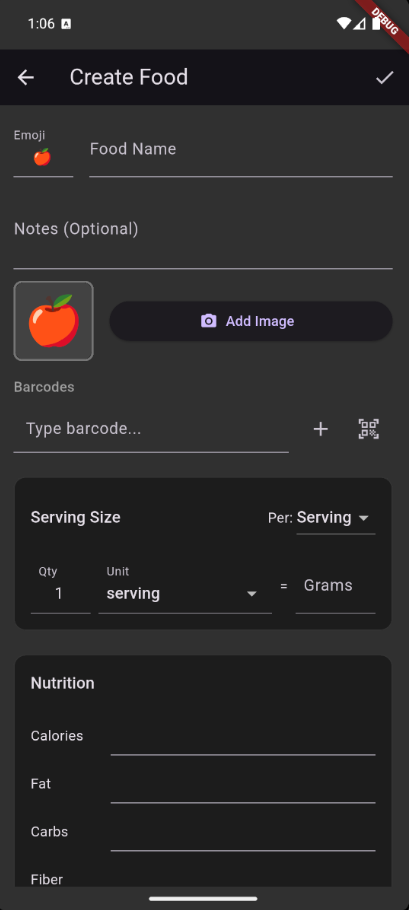

# Creating Custom Foods

Sometimes the food you're eating can't practically be found in a database. If it's a homemade recipe from a friend, a local bakery item, or or you don't have internet access, that's when you create a custom food.

## When to Create a Custom Food

- You can't find the food in search or Open Food Facts
- You have a nutrition label and want to enter the values yourself
- You want a personalized entry for something you eat regularly

## Step by Step

### 1. Open the Food Edit Screen

From the Search screen, tap the **Create Food** button to open a blank Food Edit screen.

### 2. Name Your Food

Give it a name you'll recognize when searching later. The app will **auto-suggest an emoji** based on the name — a fun touch that also makes foods easier to spot in lists.

### 3. Enter Nutrition Information

You have two ways to enter macros:

=== "Per Serving"

    Enter the nutrition values for **one serving** of the food. This is the most common approach when you're reading a nutrition label.

    For example, if a protein bar's label says 210 calories, 20g protein, 8g fat, 15g carbs per bar — enter those values and define a serving called "1 bar" at 65g. Similarly, if a package of cookies has a serving size of "3 cookies", then the Qty could be 3, the unit could be "cookie", and so on.

=== "Per 100g"

    Enter the nutrition values for **100 grams** of the food. This works well for bulk ingredients you'll always weigh on a scale, like chicken breast or rice.

### 4. Define Serving Sizes

A serving is just a named weight — "1 bar" = 65g, "1 tbsp" = 15g, "1 cup" = 240g. You can add as many as you like.

Good serving definitions make logging faster, because you can tap a dropdown and pick "1 cup" instead of remembering that a cup weighs 240 grams.

!!! example "Serving size examples"
    - **Protein bar**: One serving = "1 bar" at 65g. You enter macros for the whole bar.
    - **Homemade hummus**: Define "1 tbsp" at 15g and "1 cup" at 240g. Enter macros for whichever you measured.
    - **Bulk chicken breast**: Just use per-100g mode and weigh it each time.

### 5. Add a Photo (Optional)

You can attach a photo to help you recognize the food at a glance. The app automatically resizes images to keep things fast.

### 6. Add Barcodes (Optional)

If the food has a barcode, you can scan it and attach it to your custom food. Next time you scan that barcode, your custom entry will come up automatically.

### 7. Save

Tap **Save** to add the food to your personal library. It will appear at the top of future search results (gray background).

!!! tip "Save & Use"
    If you're creating a food in the middle of logging a meal, tap **Save & Use** to save the food and immediately add it to your Log Queue — no need to search for it again.

## Math in Number Fields

You can type math expressions in any number field on this screen. This is handy when nutrition labels give you awkward numbers:

- A label says "about 2.5 servings per container" and you ate the whole thing? Enter `value * 2.5` in the appropriate field.
- Need to convert? Type the expression directly instead of reaching for a calculator.
