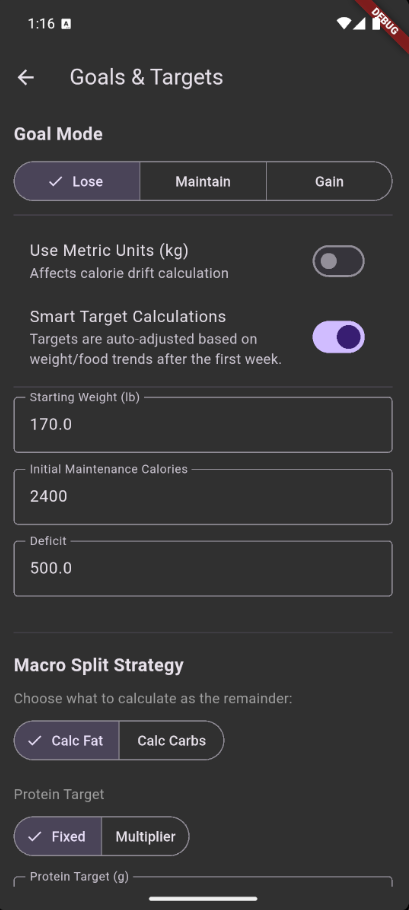
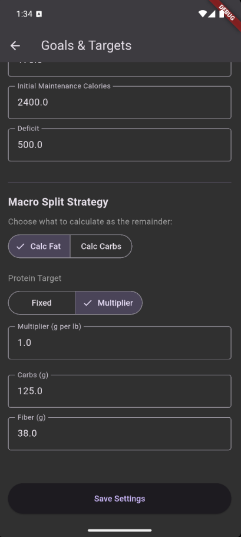

# Goals & Weight Tracking

Meal of Record can automatically adjust your daily calorie targets based on your actual weight trend and eating habits. You can also use it with a simple fixed target if you prefer.

## Setting Up Your Goals

When you first configure goals in **Settings → Goals**, you'll provide:

1. **Starting Maintenance Calories** — Your estimated total daily energy expenditure (TDEE). This is roughly how many calories you burn in a day. You can calculate this with any online TDEE calculator. Don't worry about being perfectly accurate — the app learns and adjusts over time.
2. **Your Current Weight** — Used as the starting point for trend tracking.
3. **Your Mode** — Lose, Gain, or Maintain (explained below).

---

## The Three Modes

### Lose Mode

You set a **fixed daily calorie deficit** (for example, -500 calories per day). The app subtracts this from your maintenance calories to calculate your daily target.

Your maintenance estimate will adjust over time based on your actual results, or you can turn off smart target updates.

### Gain Mode

The mirror of Lose mode. You set a **fixed daily calorie surplus** (for example, +250 calories per day). Good for lean bulking or recovery phases.

### Maintain Mode

You set an **Anchor Weight** — the weight you want to stay at. If your trend drifts above or below it, the app automatically calculates a small correction over a 30-day window to bring you back.

!!! example "Example"
    Your anchor weight is 170 lbs. After the holidays, your trend shows 173 lbs. The app calculates a gentle deficit to bring you back to 170 over the next month, then returns to maintenance.

---

## Weight Tracking
Enter your weight once a day on the **Weight** screen. A few things to know:

- **One entry per day.** If you enter it twice, the newer value replaces the old one.
- **Missing days are filtered out.** While more datapoints yields more accurate trends, occasional missed days will be ignored.
- **The trend is what matters.** The Overview screen shows a smoothed trend line that filters out daily fluctuations from water, sodium, and other noise.
- **Tap to inspect.** On the Overview graph, tap any weight point to see the exact date and value.

---

## Weekly Updates

To keep things stable and avoid chasing daily numbers, Meal of Record recalculates your targets **once per week** (every Monday).

When you first open the app on Monday, you'll see a notification with your updated calorie and macro targets for the coming seven days. This lets you plan your week around consistent numbers rather than shifting targets.

---

## Macro Splits

Beyond total calories, you can configure how those calories are divided between protein, fat, and carbs.

### Protein

Choose one of two approaches:

- **Fixed amount** — Set a specific number of grams per day. Convenient if your weight is relatively stable.
- **Weight multiplier** — Set grams per pound of body weight (commonly 0.5–1.0 g/lb). The app recalculates as your weight changes. Ideal if you're gaining or losing.

### Fat and Carbs

You specify one and the app calculates the other from the remaining calories after protein:

- **Specify fat, calculate carbs** — Useful for ensuring that you have sufficient fat while maximizing carbs. A common starting point is 70–85g of fat per day for men, 50–65g for women, though individual needs vary.
- **Specify carbs, calculate fat** — Useful for low carb diets.

---

??? info "Under the Hood: The Calorie Calculation Loop"
    The app calculates your target intake as:

    **Target = Maintenance + Delta**

    - **Maintenance** starts as your initial estimate and gets refined over time using your actual weight and calorie data. Each weekly update nudges the maintenance estimate to better match your real-world results.
    - **Delta** comes from your mode: a fixed deficit (Lose), fixed surplus (Gain), or an adaptive correction (Maintain) based on drift from your anchor weight.

    This feedback loop means that even if your initial maintenance estimate is off by a few hundred calories, the app converges on your true TDEE within a few weeks.

    **A note on the TDEE preview:** When you change the TDEE window on the Goals screen, the maintenance calories field updates to show what the app *would* estimate with that window. Each preview uses your currently saved maintenance value as its starting point. If you save and then preview again, the new saved value becomes the starting point for the next estimate — so repeatedly saving and re-previewing can cause the number to drift towards an asymptote. This is normal.
