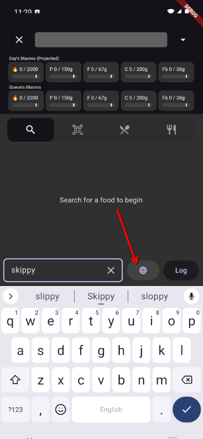
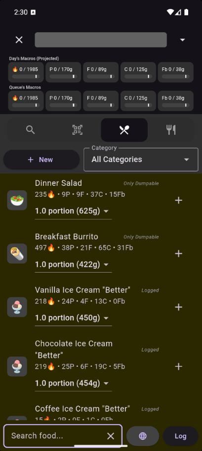
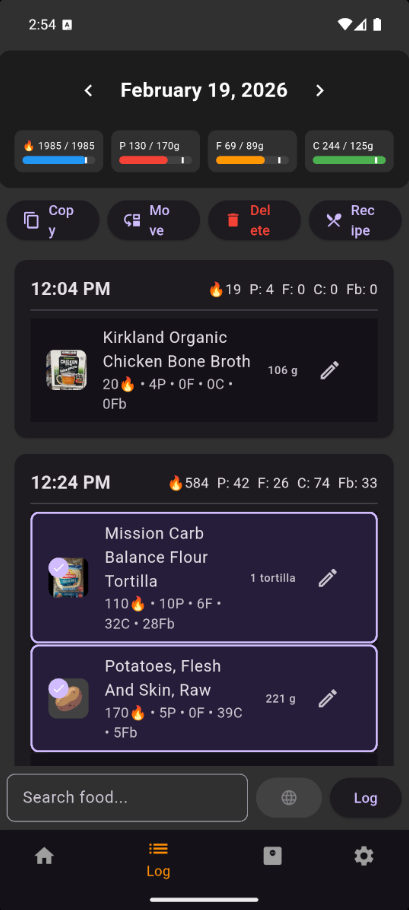

# Logging Food

Logging a meal in Meal of Record follows a simple pattern: **find food → add to queue → log**. This guide covers every way to do that, plus features that make it faster over time.

## The Basic Flow

### 1. Search for Food

From the **Overview** or **Log** screen, tap the search bar to open the Search screen.

The **Text** tab searches your personal foods first, then the built-in USDA library. Results are color-coded:

- **Gray** — Foods you've used before (shown first)
- **Blue** — USDA gold-standard reference data
- **Red** — Older USDA data

If you can't find what you need locally, tap the **globe icon** to search **Open Food Facts**, a massive database of packaged foods from around the world.

!!! tip "Barcode scanning"
    Switch to the **Barcode** tab to scan a product's barcode. The app checks your local foods, and then if it's not found locally, you can cancel, rescan, create a new food, or do an Open Food Facts search.

!!! tip "Recipe tab"
    The **Recipe** tab shows your saved recipes and templates. See [Recipes & Templates](recipes.md) for details.

    

### 2. Add to the Log Queue

Tap the **(+)** button on any search result to add one default serving to your **Log Queue**.

Use the dropdown next to the (+) button to pick a different serving before adding.

Want to enter a specific weight or custom amount? Tap the food's name to open the **Quantity Edit** screen. See the [Quanity Edit](references/quantity-edit.md) screen instructions for additional ways to practically enter amounts.

### 3. Review Your Queue

As you add items, their images appear in the bar at the top of the search screen. Tap the **down arrow** to open the full Log Queue, where you can see every pending item and their combined macro totals.

### 4. Log It

Tap **Log** to commit everything in the queue to your daily diary with the current timestamp.

---

## Quick Add

Sometimes you can't pracically accurately log a food or meal; maybe you're estimating a meal at a restaurant or friend's house. **Quick Add** lets you type in calories directly without searching for a specific food.

You'll find Quick Add on the Foods tab of the Search screen. It's handy for:

- Eating out when you've looked up the restaurant's nutrition info
- Snacks where you just know the rough calorie count
- Times when speed matters more than perfect food-level detail

!!! tip "Math in Quick Add"
    You can type math expressions in the number fields. For example, if you ate 3 servings of something that's 180 calories each, type `3 * 180`.

---

## Fasted Days

If you're intermittent fasting or simply didn't eat on a particular day, you can mark the day as **Fasted**. This tells the app that the zero-calorie day was intentional, not a day you forgot to log. Fasted days are accounted for properly in your weekly and trend calculations.

---

## Working with the Log Screen

The **Log** screen is your daily diary. It shows everything you've logged for the selected day, organized by meal.

### Navigating Days

Use the arrow buttons on either side of the day at the top to move between days and review past entries.

### Selecting and Managing Items

**Long-press** an item to enter multi-select mode, then tap additional items to select them. With items selected, you can:

- **Copy** them to a different day
- **Move** them to a different day
- **Delete** them

You can also **swipe an item left** to quickly delete it.

---

## Math Expressions

Anywhere you see a number field in the app — quantity, weight, even macro fields — you can type a math expression instead of a plain number.

This is useful when you:

- Ate a fraction of a package: `0.75 * 453` (75% of a 453g container)
- Want to add up portions: `120 + 85 + 45`
- Need to divide: `680 / 4` (splitting a dish four ways)

---

## Fill to Target

This is one of the app's most powerful features. When you're on the Quantity Edit screen, you can switch the entry mode from weight to a specific macro — **Calories**, **Protein**, **Fat**, **Carbs**, or **Fiber** — and type the amount you want to hit.

The app calculates how much of that food you'd need to eat to reach that target.

!!! example "Example: Hitting your protein goal"
    You've logged everything for the day except a chicken breast, and you need 40 more grams of protein. Open the chicken breast in Quantity Edit, switch to **Protein** mode, type `40`, and the app calculates the exact gram weight of chicken breast that you need to hit your day's target.

---

## Containers and Tare Weight

If you weigh your food in a bowl or container, the **Containers** feature saves you from doing subtraction every time.

### How It Works

1. Go to **Settings → Containers** and add your containers with their tare weights (the weight of the empty container).
2. When logging a food on the Quantity Edit screen, tap **Minus Container** and select your container.
3. The app subtracts the container's weight automatically, so you can just plop your food in, read the scale, and type the total number.

!!! example "Example"
    You want to finish the yogert that's in a container without extra steps, assuming you've pre-measured and saved the weight of a previous equivolent empty container, you can enter the total weight of the yogert and container, then select **Minus Container**, and then the particular yogert container.
