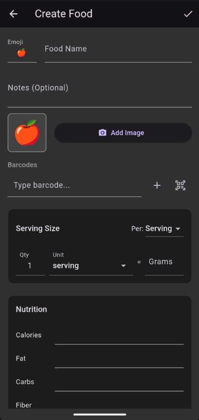

# Food Edit

Where you create and modify custom foods.

## How to Get Here

- Tap **Create New Food** on the Food tab of the Search screen
- Tap the pencil (edit button) in the top right corner of the Quantity Edit screen / search result.

## What You See

### Name and Emoji

The food's display name. As you type, the app **auto-suggests an emoji** based on the name. You can accept the suggestion or pick your own.

### Image

An optional photo for the food. The app automatically resizes images to keep things fast.

### Barcodes

You can attach one or more barcodes to the food. When you scan that barcode in the future, this food comes up automatically.

### Nutrition Entry

Two modes:

- **Per serving** — Enter macros (calories, protein, fat, carbs, fiber) for a given number of servings of the food
- **Per 100g** — Enter macros for 100 grams of the food

### Additional Servings

Named units with their gram weights. For example: "1 bar" = 65g, "1 tbsp" = 15g. Add as many as you like to make logging faster.

| Action | What It Does |
|--------|--------------|
| Food name | Set the display name (triggers emoji suggestion) |
| Add image | Attach a photo |
| Add barcode | Scan and attach a barcode |
| Per: | Switch between per-serving and per-100g |
| Add serving | Define a new named serving size |
| **Save** (in the top right corner) | Save to your personal food library |
| **Save & Use** | Save and immediately add to your Log Queue |

!!! tip "Math in number fields"
    All number fields on this screen accept math expressions. Handy when a nutrition label says something like "2.5 servings per container" and you need to multiply values.