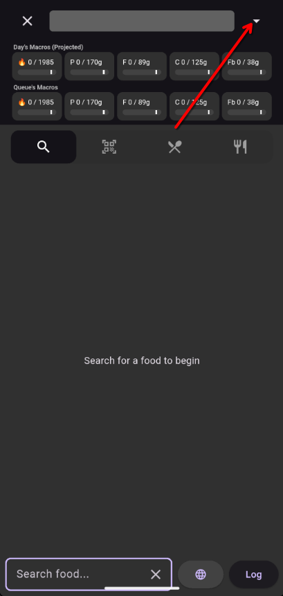
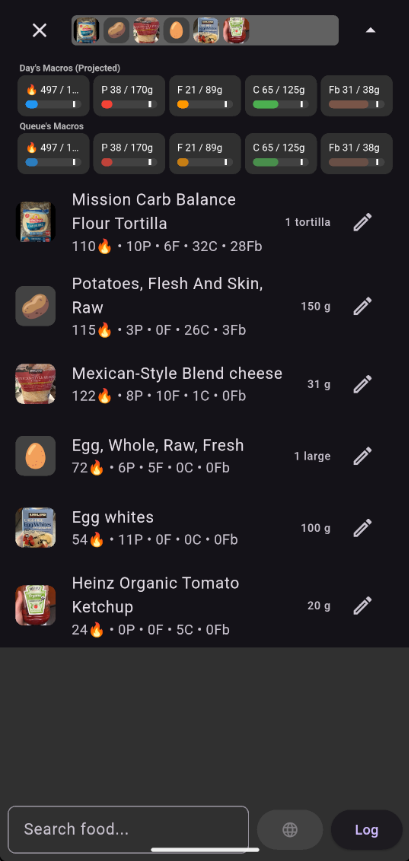
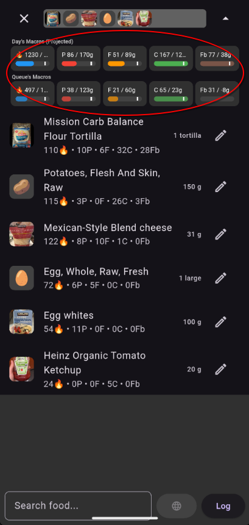

# Log Queue

Your staging area. Review and adjust a meal's worth of items before committing them to your log.

## How to Get Here

Tap the **down arrow** in the top bar of the Search screen. You can also tap the image preview bar that appears as you add items.

## What You See

### Pending Items List

Every food you've added from search but haven't logged yet, shown with its name, quantity, and macro totals.

### Macro Ribbon

A running total of calories, protein, fat, and carbs for everything in the queue. This updates live as you add or remove items, showing you the combined impact of the meal you're building.

## Actions

| Action | What It Does |
|--------|--------------|
| Tap an item | Open it in Quantity Edit to adjust the amount |
| Slide an item left | Remove it from the queue |
| Tap **Log** | Commit all items to your daily diary with the current timestamp |
| Tap the **up arrow** | Return to the Search screen |

!!! tip "Build meals, not individual items"
    The queue is designed for assembling a full meal — add your protein, your side, your drink, review the combined macros, then log everything at once.
