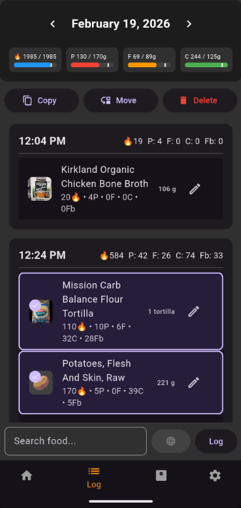

# Log Screen

Your daily food diary. Shows everything you've logged for the selected day.

## How to Get Here

Tap the **Log** tab in the bottom navigation.

## What You See

### Daily Entries

All logged food items for the day, grouped by meal. Each entry shows the food name, serving size, and macro summary.

### Daily Macro Bars

Bars at the top showing your running total of calories, protein, fat, and carbs against your daily targets.

### Date Navigation

The current date is displayed at the top. Swipe left and right or tap the date controls to move between days.

## Actions

| Action | What It Does |
|--------|--------------|
| Swipe an item left | Delete that entry |
| Tap an item's Edit button | Open it in Quantity Edit to adjust the amount |
| Tap an item | Enter multi-select mode |
| Tap items (in multi-select) | Toggle selection on additional items |
| **Copy** (multi-select) | Copy selected items to a different day |
| **Move** (multi-select) | Move selected items to a different day |
| **Delete** (multi-select) | Delete all selected items |
| Tap the search bar | Open Search to add more food |

!!! tip "Multi-select for meal planning"
    Long-press to select a full meal's worth of items, then copy them to tomorrow. Handy when you meal-prep the same lunch several days in a row.

    
