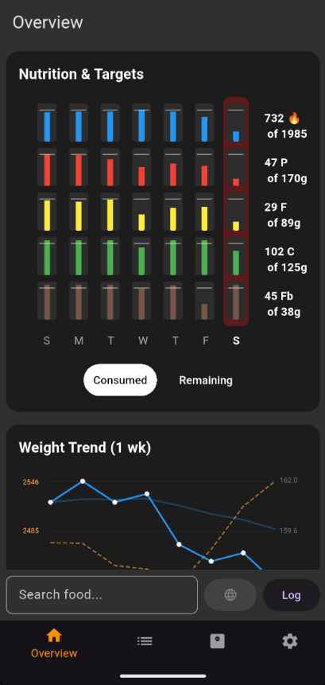

# Overview Screen

Your dashboard. Shows how the current week is going at a glance.

## How to Get Here

This is the default screen when you open the app. Tap the **Overview** tab in the bottom navigation.

## What You See

### Macro Bars

A row of bars for each day of the week showing your calorie, protein, fat, and carb intake against your targets. At a glance, you can see which days you're on track and which you're over or under. Tapping on a day's bars will display it's macros in the text to the right.

### Weight Trend Chart

A graph showing your weight entries and a smoothed trend line. The trend filters out daily fluctuations so you can see your real trajectory.

- **Tap a point** on the graph to see the exact date and weight value.
- **TDEE overlay** — The chart can show your estimated maintenance calories overlaid on the weight trend, giving you a sense of how your intake and weight are connected.

### Time Period Selector

Switch between different time windows to zoom in on the current week or zoom out to see longer trends.

## Actions

| Action | What It Does |
|--------|--------------|
| Tap a macro bar | See the detailed breakdown for that day |
| Tap a weight point | Shows the exact date and weight value |
| Tap the search bar | Opens the Search screen to log food |
| Switch time period | Changes the date range for the chart |
