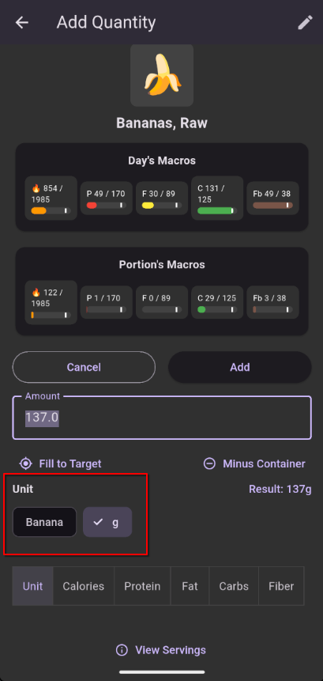
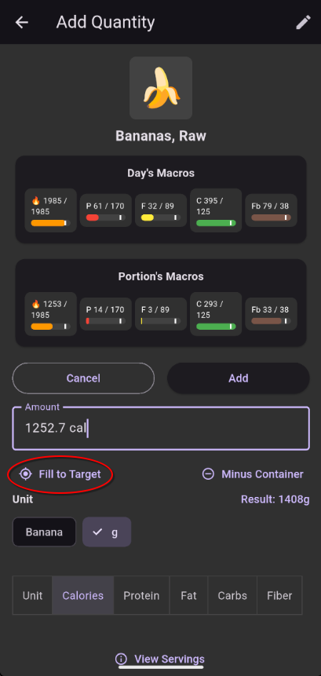
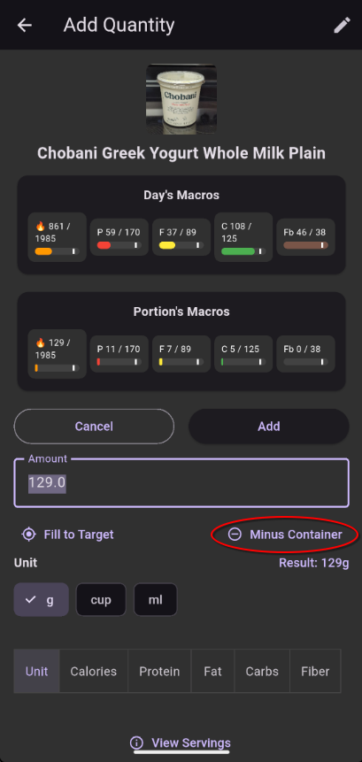

# Quantity Edit

The precision screen. Control the exact amount and unit of a food to log.

## How to Get Here

Tap a food's **name** (not the + button) from Search results, the Log Queue, or a logged entry on the Log screen.

## What You See

### Unit Selector

A set of buttons showing all available serving sizes for the specific food (e.g., "cup", "piece", "g", or custom servings). Pick the unit that matches how you're measuring.

### Quantity Field

Enter the number of units. For example, if you picked "1 cup" and ate a cup and a half, enter `1.5`.

### Live Macro Preview

As you adjust the quantity, the calorie and macro totals update in real time so you can see exactly what you'll be logging. For example, if you enter that you want 20g of protein via protein powder, this will show how much protein powder to weigh out.

## Special Entry Modes

### Macro Target Mode

Instead of entering a weight or serving count, you can switch the entry mode to a specific macro:

- **Calories** — Enter a calorie amount; the app calculates the food weight
- **Protein** — Enter grams of protein; the app calculates the food weight
- **Fat**, **Carbs**, **Fiber** — Same idea

This is the basis of the **Fill to Target** feature: figure out how much of a food you need to hit a specific number.

### Minus Container

If you're weighing food in a container, tap **Minus Container** and select a saved container. The app subtracts the container's tare weight from whatever number you enter.

## Actions

| Action | What It Does |
|--------|--------------|
| Change unit | Switch between serving sizes |
| Enter amount | Set the amount (supports math expressions) |
| Switch to macro mode | Enter a target calorie/protein/fat/carbs/fiber amount |
| Minus Container | Subtract a container's weight automatically |
| Confirm | Add the item to the queue or update the logged entry |
