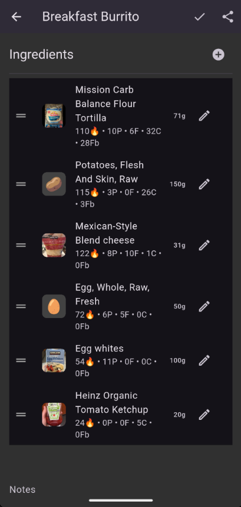
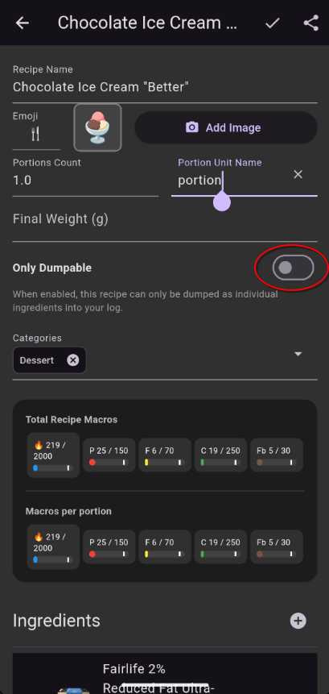

# Recipe Edit

Where you create and modify recipes.

## How to Get Here

- Tap **New** on the Recipe tab of the Search screen
- Swipe an existing recipe to the right and then tap **Edit**.

## What You See

### Ingredients List

All the foods (and nested recipes) that make up this recipe, each with its quantity and serving size.

### Portions

How many servings the batch makes (e.g., 24 cookies, 6 bowls of soup). This is used to calculate per-serving macros when you log the recipe.

### Total Weight

The final weight of the finished batch. While typically unnecessary, can be enabling for things like soup or jerky were appreciable amounts of water can be gained or lost, or where lots of zero calorie sweeteners are added.

### Regular / Dump Toggle

Switch between **Regular** (logged as a single item) and **Dump** (ingredients logged individually). See [Recipes & Templates](../guides/recipes.md) for when to use each.

## Actions

| Action | What It Does |
|--------|--------------|
| Add ingredient | Search for a food or recipe to add |
| Tap an ingredient | Adjust its quantity |
| Remove an ingredient | Swipe or tap the remove button |
| Set portions | Define how many servings the batch makes |
| Set total weight | Enter the finished batch weight |
| Toggle Regular/Dump | Choose the recipe type |
| **Save** | Save the recipe to your library |
| **Save & Use** | Save and immediately add to your Log Queue |
| **Share** | Generate QR codes to share with another user |