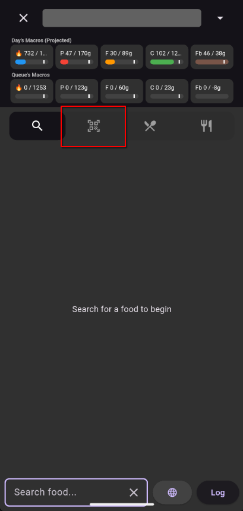

# Search Screen

The gateway to adding food to your log. Search, scan, browse recipes, and use Quick Add.

## How to Get Here

Tap the **search bar** at the bottom of the Overview or Log screen.

## Tabs

### Text Search

The default tab. Type a food name to search your personal foods and the built-in USDA library simultaneously.

**Color coding:**

- **Gray background** — Foods from your personal library (always shown first)
- **Blue background** — USDA gold-standard reference data
- **Red background** — Older USDA data

**Globe icon** — Tap to extend your search to Open Food Facts, a database of millions of packaged products worldwide.

### Barcode Search

Switch to this tab to scan a barcode. The app checks your local foods first, then Open Food Facts.

### Recipe Search

Browse and search your saved recipes and templates. Tap to add a regular recipe or dump a template's ingredients into your queue.

## Interacting with Results

| Action | What It Does |
|--------|--------------|
| Tap the **(+)** button | Add one default serving to the Log Queue |
| Use the dropdown | Pick a serving size before adding |
| Tap the food's name | Open the Quantity Edit screen for precise entry |
| Slide a result | Reveals additional actions (e.g., Dump for recipes) |
| Tap an image (OFF results) | Expands the product image for a closer look |

## Other Actions

- **Quick Add** — Enter calories and macros directly without searching for a food
- **Create Food** — Open the Food Edit screen to add a new custom food
- **Fasted** — Mark the current day as a fasted day

!!! tip "The Log Queue preview"
    As you add items, their images appear in a bar at the top of the screen. Tap the **down arrow** to open the full Log Queue. Tap the **up arrow** from the queue to return to search.

    
