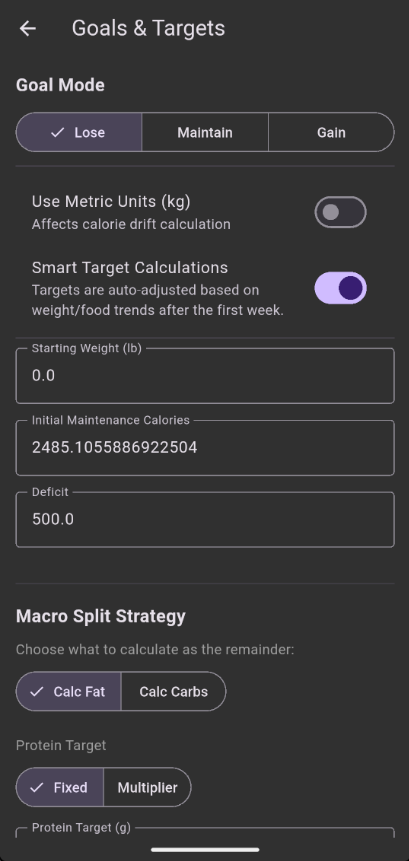
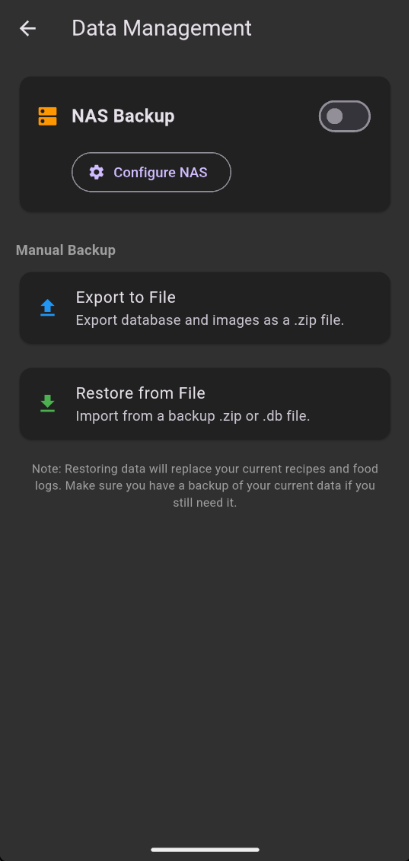

# Settings

App configuration, goals, containers, and data management.

## How to Get Here

Tap the **Settings** tab, the gear icon, in the bottom navigation.

## Sections

### Goals

Configure your calorie and macro targets. See [Goals & Weight Tracking](../guides/goals.md) for a detailed walkthrough.

- Starting maintenance calories
- Mode (Lose / Gain / Maintain)
- Deficit or surplus amount
- Anchor weight (Maintain mode)
- Protein strategy (fixed or weight multiplier)
- Fat / Carb split

### Containers

Manage containers for tare-weight subtraction when weighing food on a scale.

| Action | What It Does |
|--------|--------------|
| Add container | Create a new container with a name and tare weight |
| Edit container | Change the name or tare weight |
| Delete container | Remove a container |

!!! tip "What's a tare weight?"
    It's the weight of the empty container. If your bowl weighs 320g and you put food in it reading 450g on the scale, the app subtracts 320g and logs 130g of food. Add your common bowls, plates, and containers here so you never have to do that math yourself.

    

### Data Management

Access backup and restore features. See [Backing Up Your Data](../guides/backups.md) for details.

- NAS/WebDAV automatic backup configuration
- Manual export
- Manual import
- Backup retention settings

